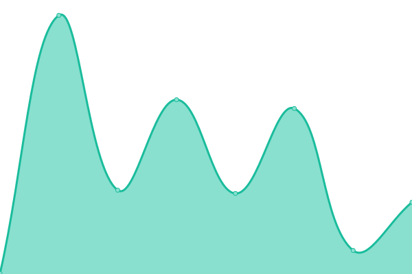
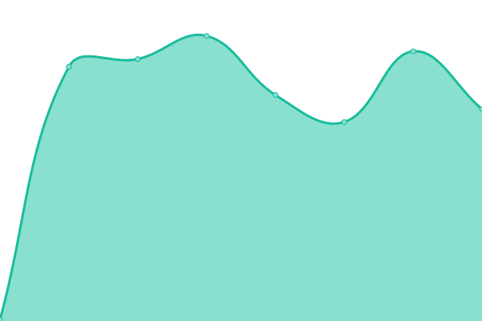

# [📈 Live Status](https://owid.github.io/status): <!--live status--> **🟩 All systems operational**

This repository contains the open-source uptime monitor and status page for [Our World in Data](https://ourworldindata.org), powered by [Upptime](https://github.com/upptime/upptime).

With [Upptime](https://upptime.js.org), you can get your own unlimited and free uptime monitor and status page, powered entirely by a GitHub repository. We use [Issues](https://github.com/owid/status/issues) as incident reports, [Actions](https://github.com/owid/status/actions) as uptime monitors, and [Pages](https://owid.github.io/status) for the status page.

<!--start: status pages-->
<!-- This summary is generated by Upptime (https://github.com/upptime/upptime) -->
<!-- Do not edit this manually, your changes will be overwritten -->
<!-- prettier-ignore -->
| URL | Status | History | Response Time | Uptime |
| --- | ------ | ------- | ------------- | ------ |
|  [Our World In Data](https://ourworldindata.org/) | 🟩 Up | [our-world-in-data.yml](https://github.com/owid/status/commits/HEAD/history/our-world-in-data.yml) | 

 281ms
     
 | 

<a href="https://owid.github.io/status/history/our-world-in-data">100.00%</a>
    

|  [Data catalog (garden)](https://catalog.ourworldindata.org/catalog-garden.feather) | 🟩 Up | [data-catalog-garden.yml](https://github.com/owid/status/commits/HEAD/history/data-catalog-garden.yml) | 

 216ms
     
 | 

<a href="https://owid.github.io/status/history/data-catalog-garden">100.00%</a>
    

|  [Admin (owid.cloud)](https://owid.cloud/api/health) | 🟩 Up | [admin-owid-cloud.yml](https://github.com/owid/status/commits/HEAD/history/admin-owid-cloud.yml) | 

 289ms
     
 | 

<a href="https://owid.github.io/status/history/admin-owid-cloud">100.00%</a>
    

<!--end: status pages-->

[**Visit our status website →**](https://owid.github.io/status)

## 📄 License

- Powered by: [Upptime](https://github.com/upptime/upptime)
- Code: [MIT](./LICENSE) © [Our World in Data](https://ourworldindata.org)
- Data in the `./history` directory: [Open Database License](https://opendatacommons.org/licenses/odbl/1-0/)
